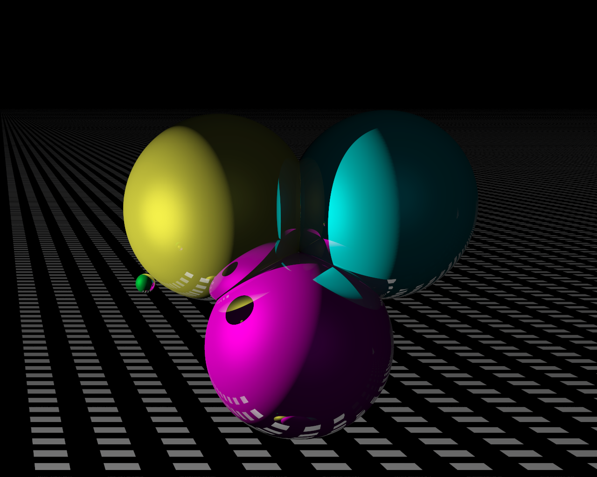

A basic C++ ray tracer based on the Codermind ray tracing tutorial.

# Introduction

Written in C++ this code uses some basic ray-tracing techniques to render the scene below:

<p align="center">
    
</p>

# Quick Start

```sh
mkdir build
cd build
cmake ..
make
cd ..
./go
```

# License

This is a public domain work, dedicated using CC0 1.0. Feel free to do whatever you want with it.
